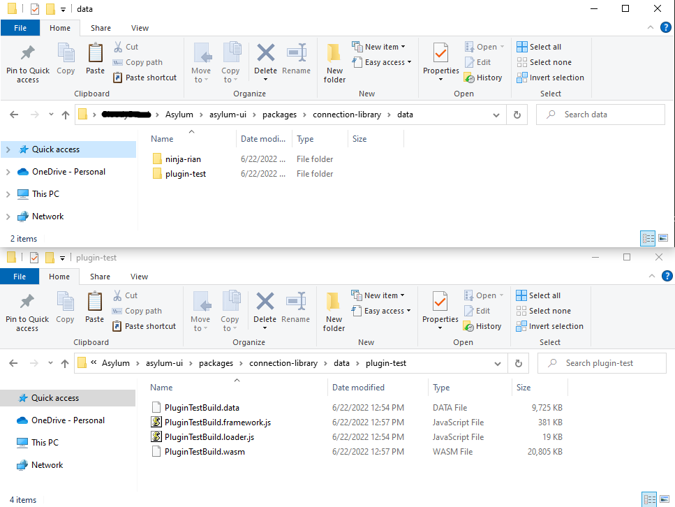
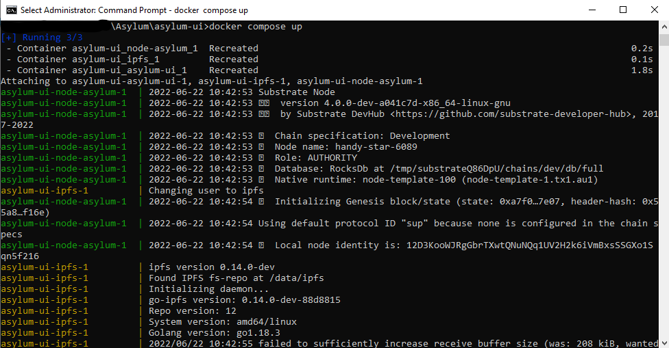
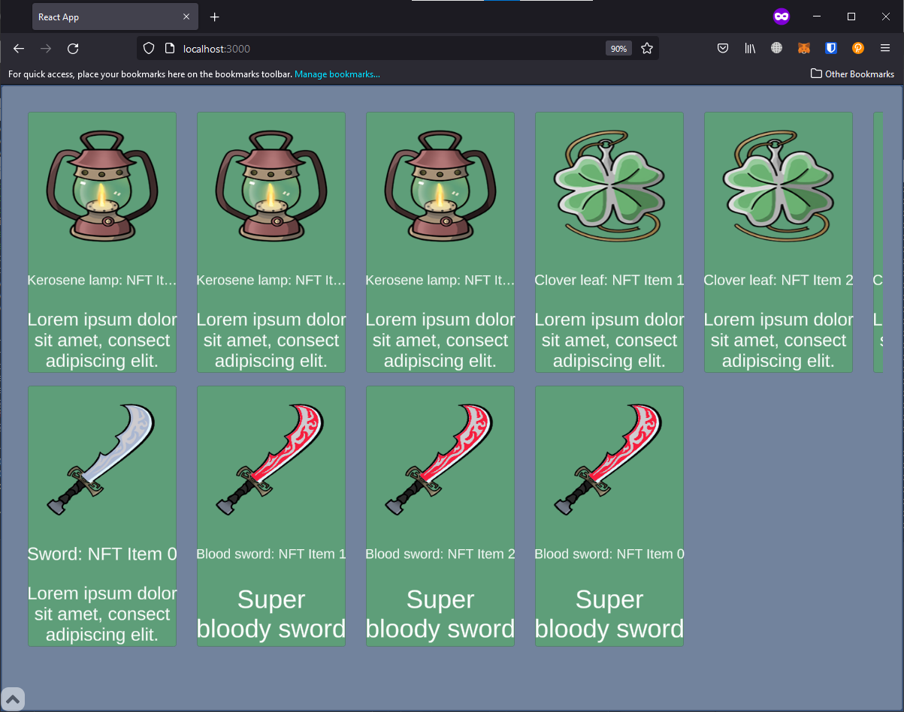

# Asylum Unity SDK

Asylum Unity SDK. Provides plugins, editor scripts, and a set of utilities to integrate with the Asylum ecosystem

The plugin is created for the Unity, and WebGL builds. You can run this build natively within HTML page or inside React application with the help of [react-unity-webgl](https://www.npmjs.com/package/react-unity-webgl). To ease the integration with Asylum ecosystem you can run the build via [Game Developers Console](https://gitlab.com/asylum-space/asylum-ui/-/tree/main/packages/game-developers-console) ([see below](#run-the-build-inside-game-developer-console))

> Unity version supported: ^2021.3

## Plugin inwards
- `jslib` file is responsible for the connection between Unity and JS code, which runs the build
- `AsylumEntities.cs` file contains types and entities you need to initialize Asylum NFT Items
- `ReactControllerScript.cs` file responsible for connection between Unity life circle and `jslib`, parsing and downloading on-chain data

## Building process

> NOTE: For testing purpose is strictly required using Asylum Unity SDK in pair with GDC only

### Using test project
- Download or clone [example project](https://gitlab.com/asylum-space/asylum-unity-sdk-example)
- Step forward to the [next step](#run-the-build-inside-game-developers-console)

### Manual installation
- Create or open a Unity project (supports version 2021.3 and above)
- Import [Newtonsoft Json Unity Package](https://docs.unity3d.com/Packages/com.unity.nuget.newtonsoft-json@2.0/manual/index.html) using [AssetPackagesImport](https://docs.unity3d.com/Manual/AssetPackagesImport.html). This is the dependency for Asylum Unity SDK.
- Put Asylum Unity SDK inside Unity `Assets/Plugins` folder
- Step forward to the [next step](#run-the-build-inside-game-developers-console)

## Run the build inside Game Developers Console
1. Change the _"Compression format"_ in the **Edit > Project Settings > Player > WebGL settings > Publishing settings** to the _"Disabled"_

2. (Optional) Switch platform to the WebGL in the **File > Build Settings**, if another platform is chosen

3. Form WebGL build: **File > Build Settings > Build**. The output WebGL build contains 4 files in the _BuildDirectory/Build_:
    - BuildName.data
    - BuildName.framework.js
    - BuildName.loader.js
    - BuildName.wasm


4. Place these files inside **asylum-ui/packages/connection-library/data/build_name** and the path to the build within `const games: IGameMockData[]` inside **asylum-ui/packages/connection-library/seed/mocks.ts**:
```ts
export const games: IGameMockData[] = [
...
{
    id: 'game_id',
    title: 'Your Game',
    img: 'image_url',
    genre: '...',
    shortDescription: '...',
    description: '...',
    gallery: [...],
    supportedTemplates: [0, 1, 2, 3],
    gameClient: {
         data: 'data/build_name/BuildName.data',
         framework: 'data/build_name/BuildName.framework.js',
         loader: 'data/build_name/BuildName.loader.js',
         wasm: 'data/build_name/BuildName.wasm',
    }
}
...
```




5. [Download](https://docs.docker.com/get-docker/), install and run Docker
6. Run the following command in the console at the root folder
```
docker compose up
```



7. Open a web browser and go to the http://localhost:3000/

8. Add the wallet and connect to the local node


9. Choose the game and press the _Run_ button. 


10. The game is running



>NOTE : A manual and more detailed guide is available at [Game Developers Console (manual setup)](https://gitlab.com/asylum-space/asylum-ui/-/tree/main/packages/game-developers-console#run-game-developers-console-manual-setup).

## ReactControllerScript API
Actions and properties:
- `UniqItems` - returns the list of the loaded items
- `GetItemMetadata` - returns item's metadata
- `GetInterpretationSourceData` - returns interpretation source data
- `GetInterpretationTags` - retursn array of the interpretation tags
- `GetInterpretationMetadata` -returns interpretation metadata

Events:
- `OnItemsAddedAction` - when all user items was parsed and initialized in the ReactController
- `OnItemMetadataLoadedAction` - when item metadata was loaded
- `OnInterpretationSourceLoadedAction` - when interpretation source data was loaded
- `OnInterpretationMetadataLoadedAction` - when interpretation metadata was loaded
- `OnPauseRequestedAction` - when react.application is requested game pause

### Usage
- Create empty `GameObject` named `ReactController` in the scene and add `ReactControllerScript.cs` as its component
- Create new C# script(e.g. `ItemsController`) and link `ReactControllerScript` component to it. You can do it via inspector, using public/serializable fields or [FindObjectOfType method](https://docs.unity3d.com/ScriptReference/Object.FindObjectOfType.html) or with the help of dependency injection (like Zenject)
    ```cs
        //ItemsController.cs

        void Start
        {
            ReactControllerScript reactControllerInstance = FindObjectOfType<ReactControllerScript>();
        }
    ```
- Get user items list in the `ItemsController` simply calling property `ItemsList` or subsribe on the event `OnItemsAddedAction`
    ```cs
        // ItemsController.cs

        ReactControllerScript reactControllerInstance;

        void Start()
        {
            // Manual call
            // List<AsylumItem> items = reactControllerInstance.ItemsList;

            // Subsribe on event
            reactControllerInstance.OnItemsAddedAction += OnItemAdded;
        }

        void OnItemAdded(List<AsylumItem> items)
        {
            ...
        }
    ```
- Get user items metadata inside `ItemsController` by calling `GetItemMetadata` or subsribe on the event `OnItemMetadataLoaded`
    ```cs
        //ItemsController.cs

        ReactControllerScript reactControllerInstance;
        ItemCombineID id;

        void Start()
        {
            // Manual call
            // Dictionary<string, string> itemMetadata = reactControllerInstance.GetItemMetadata(id);
            
            // Subsribe on event
            reactControllerInstance.OnItemMetadataLoadedAction += OnItemMetadataLoaded;
        }

        void OnItemMetadataLoaded(ItemCombineID itemID , Dictionary<string, string> metadata)
        {
            ...
        }
    ```
- After getting the item's data, it’s possible to display it in-game. Let's try to load `default-view` interpretation using [UI:Image](https://docs.unity3d.com/2021.3/Documentation/ScriptReference/UIElements.Image.html)

    ```cs
        //ItemsController.cs

        ReactControllerScript reactControllerInstance;
        Image image;

        void Start()
        {
            reactControllerInstance.OnInterpretationSourceLoadedAction += OnInterpretationSourceLoaded;
        }

        private void OnInterpretationSourceLoaded(InterpretationCombineID interpretationID, string[] tags, byte[] rawData)
        {
            if (Array.Exists(tags, tag => tag == "default-view"))
            {
                Texture2D texture = new Texture2D(1, 1);
                if (texture.LoadImage(rawData))
                {
                    image.sprite = Sprite.Create(texture, new Rect(0, 0, texture.width, texture.height), new Vector2(texture.width / 2, texture.height / 2));
                }
            }
        }
    ```
